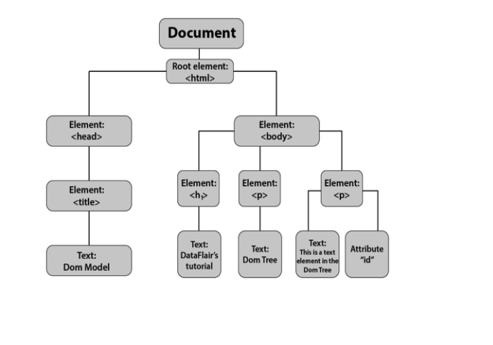

# 문서 객체 모델 (DOM)

---

- DOM(Document Object Model)
- html 문서의 구조와 관계를 객체로 표현  -> html ,css ,js ... 
- 최상단 인터페이스로 Node가 있다


-> 이 구조를 코드로 나타내면, 
```html
<html>
	<head>
		<title>DomModle</title>
	</head>
	<body>
		<h1>Dom Flair's tutorial</h1>
		<p>DomTree</p>
		<p id = 'p1'>This is ..</p>
	</body>
</html>

```

- DOM 이 관리 하기에 화면 구성 및 업데이트를 DOM API 를 활용해서 접근 해야한다. 
  - 리엑트 같은 프레임워크에서는 자동으로 해주지만, 기본적인 흐름을 알고 있어보자!


- Node 하위에 Element, Attribute.. 있어서 엘리먼트 노드, 어트리뷰트 노드 하고 하기도하고, 노드 느낌 이기도 하고 . 
